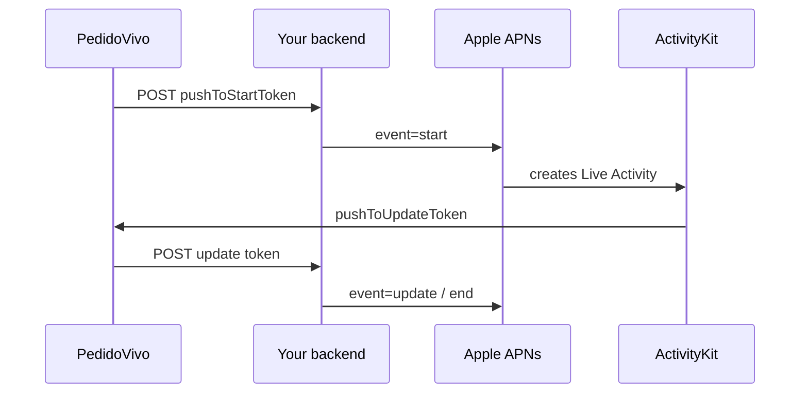

# PedidoVivo — Live Activities 100% via APNs

Open-source Expo / React Native tutorial app that demonstrates **iOS Live Activities** started, updated, and ended **only through Apple Push Notification service (APNs)**.

The happy path never calls `Activity.request` / `startActivity` from the app. ActivityKit creates the Live Activity when APNs delivers `event: "start"` to the **push-to-start** token.

Use it as a learning project, fork it for your product, adapt it, ship it commercially — see [License](#license).

## Why this exists

Most Live Activity samples start the activity from JS while the app is open. Production delivery / order-tracking apps often need the activity to appear when the app is backgrounded or killed. That requires **push-to-start** (iOS 17.2+) and the correct ActivityKit tokens — not the regular APNs device token or FCM token.

## Golden rule

| Do | Don't |
|----|--------|
| Observe `pushToStartToken` → send to your backend | Call `Activity.request` on the tutorial path |
| Backend APNs `event: "start"` with `attributes-type: OrderAttributes` | Mix alert push with Live Activity tokens |
| Observe `pushToUpdateToken` → send to your backend | Use FCM / silent push to *start* the Live Activity |
| Backend APNs `event: "update"` / `event: "end"` | Reuse the FCM or APNs device token as a Live Activity token |



## Stack

| Layer | Technology |
|-------|------------|
| App | [Expo](https://expo.dev) SDK 57, [React Native](https://reactnative.dev), TypeScript |
| Native builds | [expo-dev-client](https://docs.expo.dev/develop/development-builds/introduction/), `expo prebuild` / `expo run:ios` |
| Widget / Live Activity UI | [@bacons/apple-targets](https://github.com/EvanBacon/expo-apple-targets) (Widget Extension + SwiftUI + ActivityKit) |
| Token bridge | Local Expo Module in `modules/live-activities/` (Swift → JS events only) |
| Config plugin | `plugins/withLiveActivities.js` — `NSSupportsLiveActivities` (+ frequent updates) |
| Push (optional, for FCM / device APNs testing) | [@react-native-firebase/messaging](https://rnfirebase.io/messaging/usage) + `expo-notifications` |
| Tests | [Vitest](https://vitest.dev) (payload helpers, permissions, flow contracts) |
| Articles | Markdown series under `tutorial/medium/` (when present in your checkout) |

## Tokens (do not mix them)

| Token | Source | Use |
|-------|--------|-----|
| FCM | `@react-native-firebase/messaging` `getToken` | Normal FCM push / Postman FCM |
| APNs device | `getAPNSToken` | Regular APNs alert / data push |
| **pushToStartToken** | ActivityKit (local module) | APNs `event: start` Live Activity |
| **pushToUpdateToken** | ActivityKit (per activity) | APNs `event: update` / `end` |

In Metro logs, filter by `[PedidoVivo][Push]` and `[PedidoVivo][LiveActivity]`.

## Requirements

- macOS with Xcode
- Apple Developer Program (your own account)
- Physical **iPhone on iOS 17.2+** (simulator does **not** reliably receive real push-to-start)
- Node.js 20+ recommended
- Firebase project (if you want FCM / device token testing as in this app)
- APNs Auth Key (`.p8`) on your Apple Developer account for Live Activity pushes

## Configure your fork

Before building, replace demo identifiers with **your** values. Do not commit private keys.

1. **`app.json`**
   - `ios.bundleIdentifier` / Android `package`
   - `ios.appleTeamId` → your Team ID
   - Widget extension bundle (under `extra.eas.build.experimental.ios.appExtensions`)
   - `extra.apiBaseUrl` → your machine LAN IP when testing POSTs from a device (e.g. `http://192.168.x.x:8787`)
   - `ios.googleServicesFile` → your `GoogleService-Info.plist`
   - EAS `projectId` if you use EAS Build

2. **Apple Developer**
   - App ID with **Push Notifications**
   - Live Activities via Info.plist keys (already set by the plugin / `infoPlist`)
   - APNs Auth Key (`.p8`) — keep it out of git (this repo gitignores `*.p8` and `/credentials/`)

3. **Firebase (optional path used here)**
   - Register the iOS app with the same bundle ID
   - Upload **your** APNs Auth Key in Project settings → Cloud Messaging
   - Place `GoogleService-Info.plist` at the path referenced in `app.json`

4. **EAS (optional)**
   - `eas init` / link your Expo account
   - Upload your Push Key to the project credentials
   - Profiles live in `eas.json` (`development` uses a development client on device)

## Run

```bash
npm install
npm run prebuild:clean   # generates ios/ with widget target
npm run ios:device       # physical device required for push-to-start
```

Useful scripts:

| Script | Purpose |
|--------|---------|
| `npm start` | Metro / Expo Go entry (native features need a dev client) |
| `npm run ios` / `ios:device` | Build & run native iOS |
| `npm run prebuild` / `prebuild:clean` | Generate native projects |
| `npm test` | Vitest once |
| `npm run test:watch` | Vitest watch |
| `npm run typecheck` | `tsc --noEmit` |

EAS example:

```bash
npx eas build --profile development --platform ios
```

## Test the Live Activity flow

1. Install the development build on a physical device and open the app.
2. Grant notification permission when prompted.
3. Copy the **pushToStartToken** from Metro (`[PedidoVivo][LiveActivity]`).
4. Send an APNs Live Activity **start** to that token (Postman, your backend, or Firebase/APNs tooling). Required pieces:
   - Header `apns-push-type: liveactivity`
   - Header `apns-topic: <yourBundleId>.push-type.liveactivity`
   - Body with `aps.event: "start"`, `attributes-type: "OrderAttributes"`, `attributes`, `content-state`, `alert`, `timestamp`
5. After the activity appears, register / copy the **pushToUpdateToken** and send `event: "update"` then `event: "end"`.

Payload helpers (for backends and tests) live in `src/apnsPayloads.ts`. Example start shape:

```json
{
  "aps": {
    "timestamp": 1710000000,
    "event": "start",
    "attributes-type": "OrderAttributes",
    "attributes": { "orderId": "ord_123" },
    "content-state": {
      "status": "preparing",
      "title": "Order #123",
      "subtitle": "Preparing your order",
      "progress": 0.25
    },
    "alert": {
      "title": "Order confirmed",
      "body": "Track on Dynamic Island"
    }
  }
}
```

A longer walkthrough (Postman / FCM) is in `tutorial/medium/06-walkthrough-curl.md` when that folder is available.

## Project structure

```
app.json / eas.json          # Expo + EAS config
App.tsx / index.ts           # UI + push bootstrap
src/                         # API client, permissions, push, APNs payload builders + tests
plugins/                     # Config plugins (Live Activities, RNFirebase SPM tweak)
modules/live-activities/     # Expo Module: tokens → JS (no start/update/end)
targets/widget/              # Widget Extension / Live Activity SwiftUI UI
docs/                        # Extra notes (generic; no personal Apple secrets)
PROMPT.md                    # Agent prompt used to build this tutorial
```

## Evolve the project

Ideas that fit this architecture:

- Add a `server/` that stores tokens and sends HTTP/2 APNs with your `.p8` (endpoints sketched in `PROMPT.md`)
- Expand `OrderAttributes` / ContentState for your domain (keep Swift struct name in sync with `attributes-type`)
- Deepen Dynamic Island / Lock Screen UI in `targets/widget/`
- Point `extra.apiBaseUrl` at a real backend instead of localhost
- Keep the module API read-only for production; only add local `Activity.request` behind an explicit debug flag if you need a comparison path

## Medium series

Chapter index: [`tutorial/medium/README.md`](./tutorial/medium/README.md) (may be local-only depending on your `.gitignore`).

## Security / what not to commit

- APNs `.p8` keys, provisioning profiles, `.env` with Team / Key IDs
- Anything under a local `credentials/` folder (gitignored here)
- Personal Apple / Expo account details in docs or README

Use placeholders in public docs. Each fork brings its own Apple Developer, Firebase, and EAS projects.

## License

[MIT](./LICENSE) — free to use, copy, modify, merge, publish, distribute, sublicense, and **sell**.

**Credit (only requirement):** keep the copyright notice and license text with the source (for example the `LICENSE` file and/or a short comment in substantial source files). You do **not** need to show credits in the shipped UI or marketing materials for end users.

```
// PedidoVivo — Live Activities via APNs
// Copyright (c) 2026 Vinicius R. Petrarchin — MIT License
```

## References

- [Apple — Starting and updating Live Activities with ActivityKit push notifications](https://developer.apple.com/documentation/activitykit/starting-and-updating-live-activities-with-activitykit-push-notifications)
- [@bacons/apple-targets](https://github.com/EvanBacon/expo-apple-targets)
- [Expo — Development builds](https://docs.expo.dev/develop/development-builds/introduction/)
- [React Native Firebase — Messaging](https://rnfirebase.io/messaging/usage)
